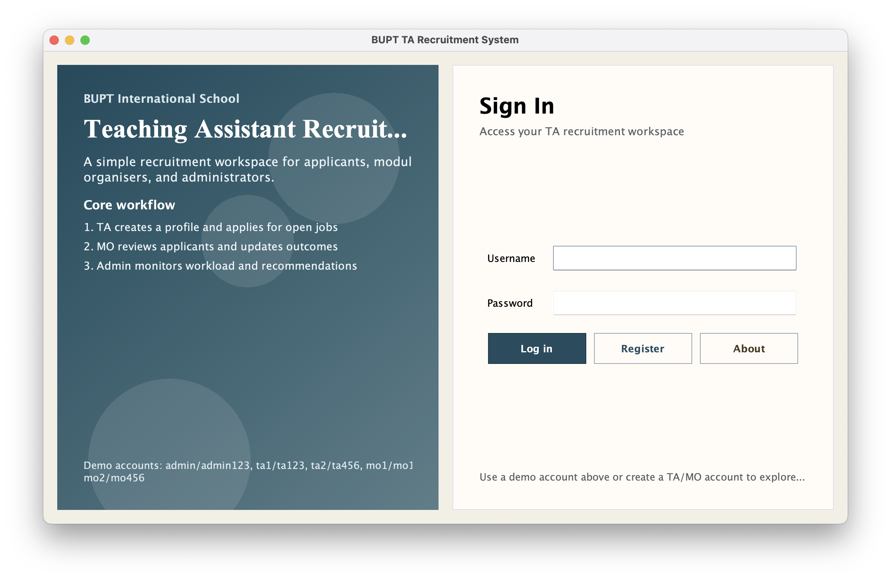
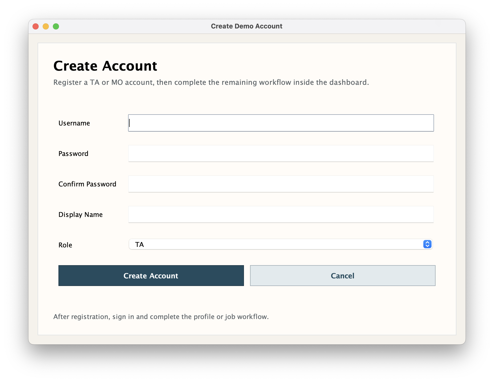
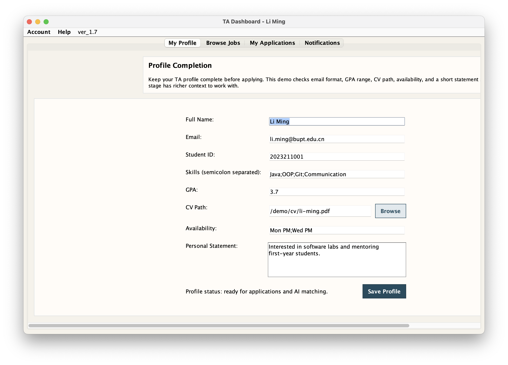
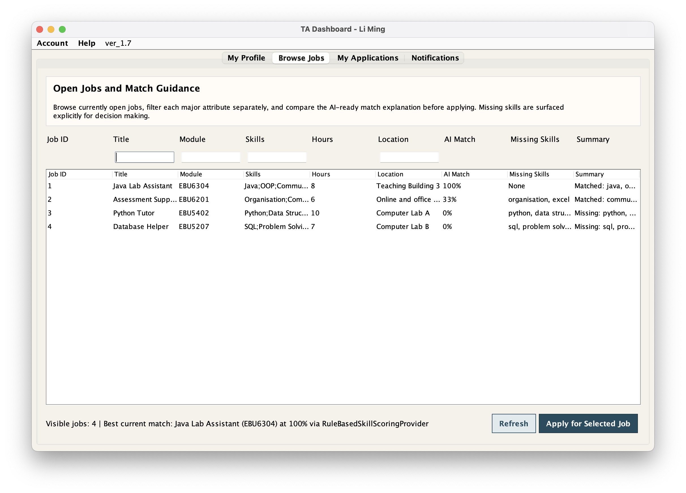
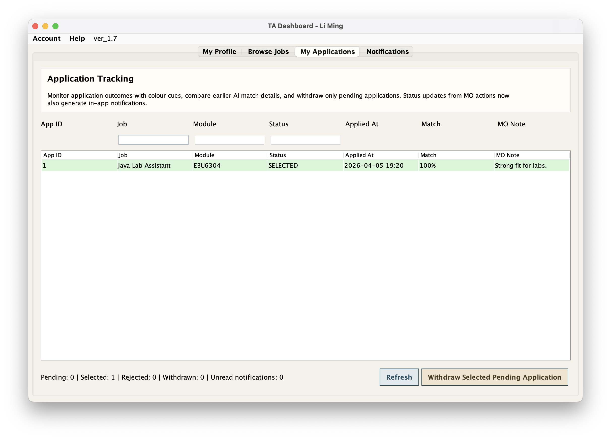
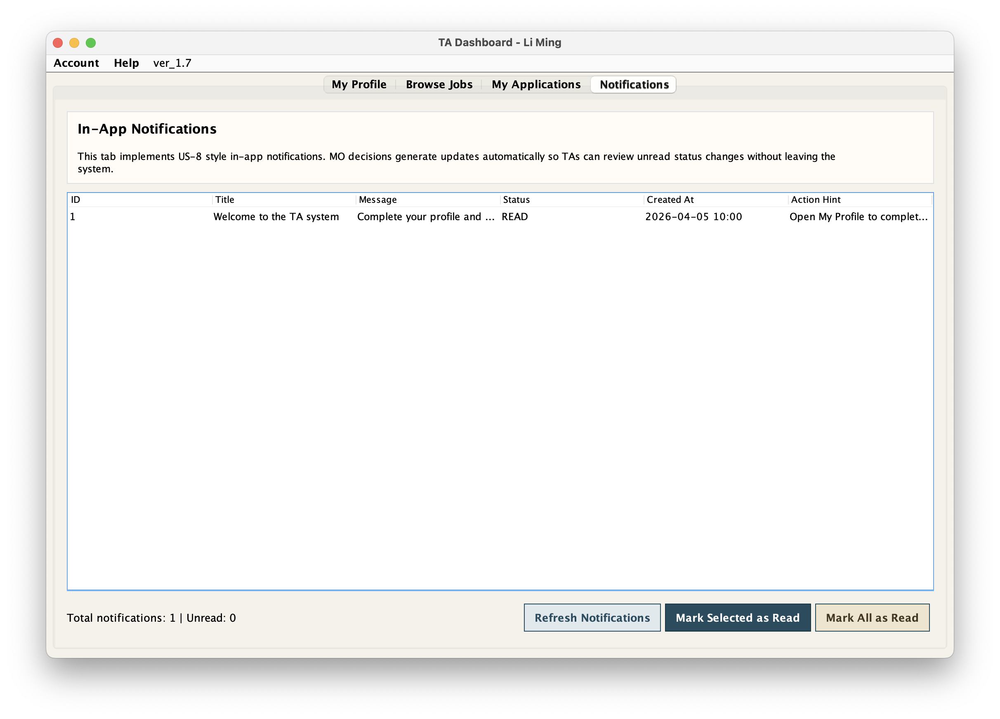
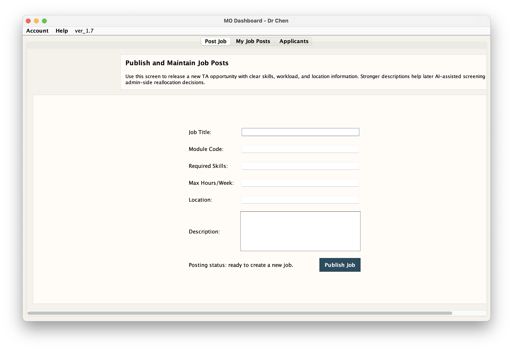
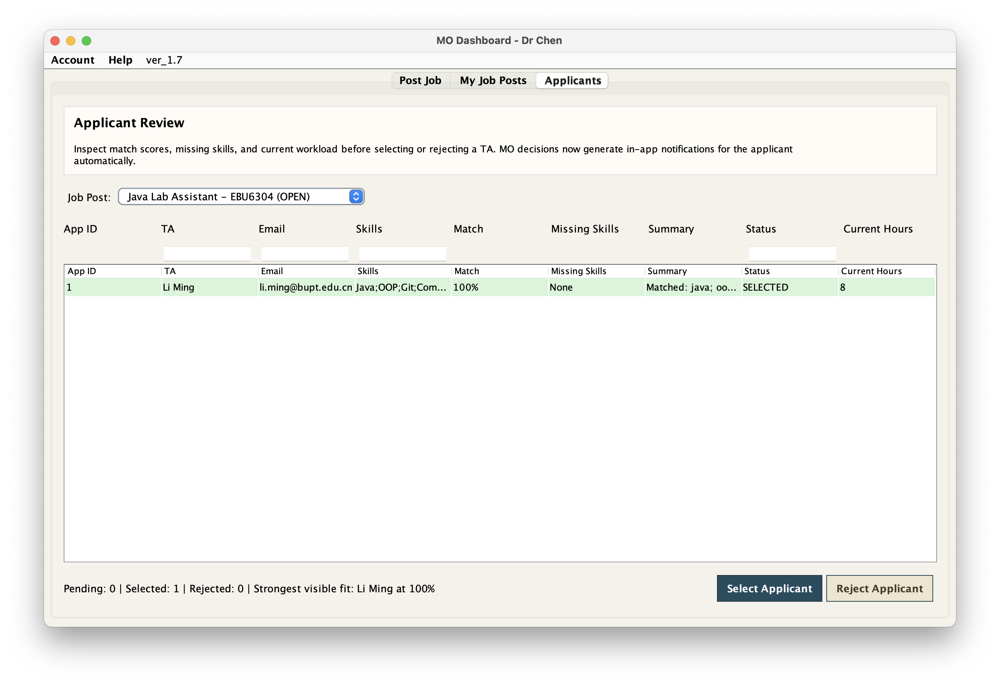
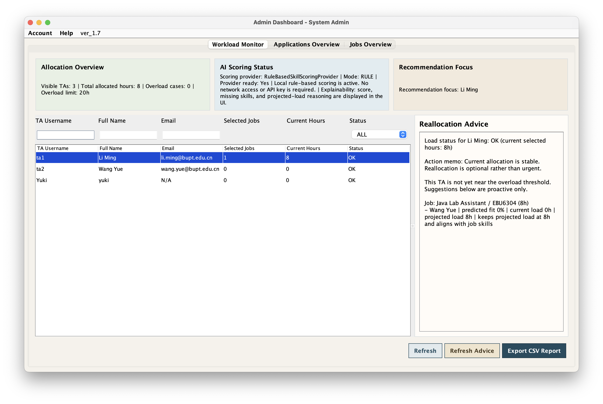
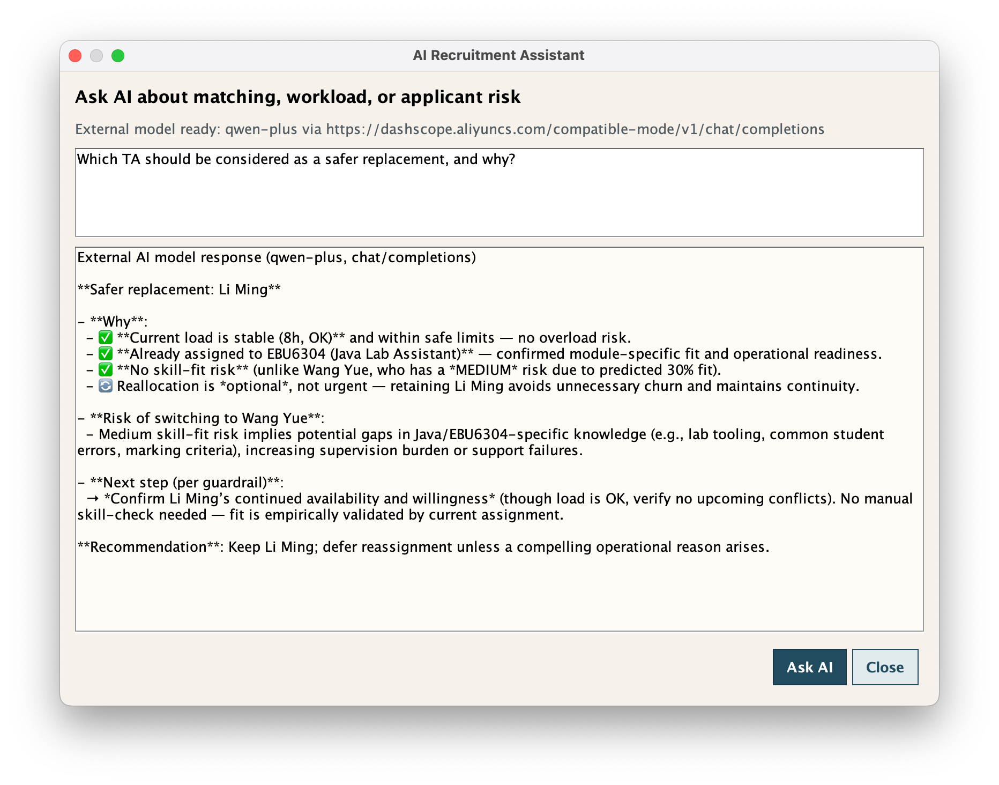

# EBU6304 Group 98 Demo Version 1.7

BUPT International School Teaching Assistant Recruitment System.

## Product Scope

This demo implements the core recruitment workflow required for a stand-alone Java application:

- TA can create and edit an applicant profile
- TA can browse open jobs and apply for them
- TA can check application status and withdraw pending applications
- TA can receive in-app notifications about application decisions, missing profile details, and closed jobs
- MO can post jobs, manage their own posts, and review applicants
- Admin can monitor TA workload, edit global application and job records, export reports, and inspect replacement recommendations
- AI-assisted scoring is included through an explainable rule-based engine and an API-ready placeholder provider

## Requirement Check

### Basic requirements covered

- stand-alone Java desktop application
- all data stored in CSV text files
- TA profile creation
- CV path selection through a local file chooser
- available job browsing
- job application flow
- application status checking
- MO job posting
- MO applicant selection and rejection
- Admin workload monitoring
- in-app notification support for applicant status updates, profile-completion reminders, and job-closure alerts

### AI-assisted functions currently covered

- matching skills between jobs and applicants
- identifying missing skills through dedicated UI output and match summaries
- workload balancing support through admin-side replacement recommendations and load warnings
- explainable recommendation text showing score source, missing skills, projected load, and action memo guidance

### Current project position

This `ver_1.0` folder now meets the mandatory platform and storage restrictions and demonstrates a selected set of core features as required by the coursework brief. It is still an iterative demo build rather than the full final coursework package, because the broader Agile evidence, formal test suite, JavaDoc delivery, and complete report package belong to the wider repository work rather than only this folder.

## Iteration 1.7 Update

This iteration moves `US-8` closer to a complete notification workflow by adding additional triggers beyond MO decision updates.

New updates in this version:

- added profile-completion reminders when a TA opens an incomplete profile or tries to apply before finishing required details
- added automatic job-closure alerts for TAs with active applications when MO or Admin closes a job
- resolved unread profile reminders after the TA saves a complete profile
- kept notifications CSV-backed so the implementation remains compatible with the coursework storage rule
- preserved the aligned table filters, missing-skills output, and explainable AI recommendation notes from the previous iteration


## Product Screenshots

Place the final product screenshots in `screenshots/` using the file names below. The images will render automatically on GitHub after the files are added.

### Login and Registration





### TA Workflow









### MO Workflow





### Admin Workflow





## Run

```bash
./compile.sh
./run.sh
```

## Optional AI Placeholder Configuration

```bash
export AI_SCORING_MODE=AI
export OPENAI_API_KEY=your_key_here
export OPENAI_MODEL=gpt-4o-mini
export OPENAI_BASE_URL=https://api.openai.com/v1
```

If these variables are not set, the demo automatically falls back to the local rule-based scorer.

## Demo Accounts

- `admin / admin123`
- `ta1 / ta123`
- `ta2 / ta456`
- `mo1 / mo123`
- `mo2 / mo456`

## Project Layout

- `src/`: Java source code
- `data/`: CSV data files
- `docs/architecture.md`: structure overview
- `docs/task_plan_alignment.md`: requirement and task-plan comparison notes
- `compile.sh`: compile script
- `run.sh`: run script

## Version Notes

- `ver_1.0`: first complete integrated demo build
- `ver_1.1`: usability-focused iteration with filtering and improved admin monitoring feedback
- `ver_1.2`: task-plan alignment update with shared dashboard base and stronger L2 authentication checks
- `ver_1.3`: stronger admin operations and AI-ready scoring abstraction for the next integration stage
- `ver_1.4`: live AI placeholder path, admin reallocation recommendations, and UI polish for the next demo stage
- `ver_1.5`: macOS-friendly entry screens, cleaner final-product styling, and stronger final-demo usability
- `ver_1.6`: CSV-backed notifications, richer AI explanation surfaces, and aligned multi-field search across key tables
- `ver_1.7`: expanded US-8 triggers with profile-completion reminders and job-closure alerts
